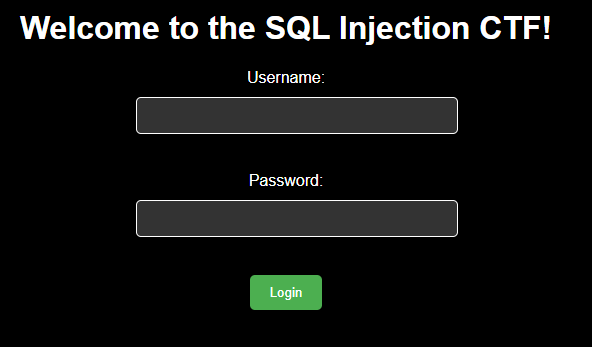
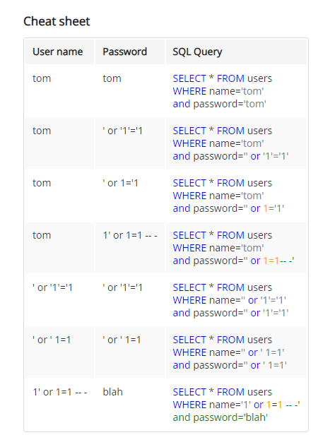
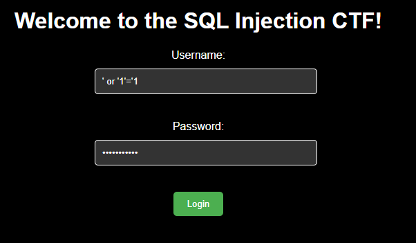
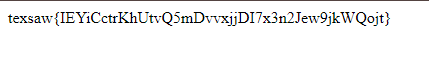

## Writeup

- Difficulty: 50 pts / 250 pts
- Description: Attempt to login into the webpage at `link`. None of the registered passwords or usernames work. Good luck :)
- Flag: `texsaw{IEYiCctrKhUtvQ5mDvvxjjDI7x3n2Jew9jkWQojt}`

We are given a website with a SQL vulnerability. 

I found this site (sechow) with some simple payloads to attempt with.

Using the examples, we inject into the login form to obtain the flag.

