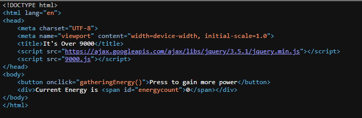
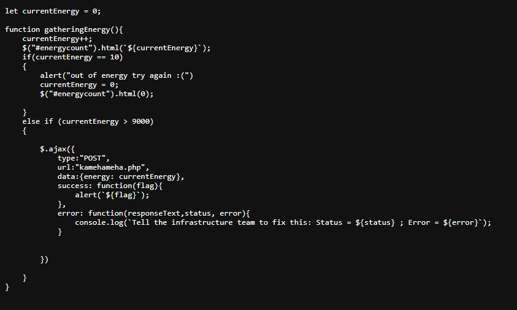
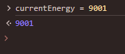
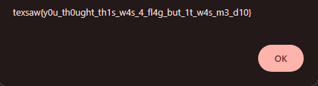

## Writeup

- Difficulty: 50 pts / 250 pts
- Description: Help Goku get over 9000 energy to defeat his enemy Vegeta and save the world.
- Flag: `texsaw{y0u_th0ught_th1s_w4s_4_fl4g_but_1t_w4s_m3_d10}`

We are given a website with only a function that increases the current energy on click.

Based on the source code, the `gatheringEnergy()` function might be referenced to `9000.js`.

From `9000.js`, we can deduce that this is a client-side vulnerability as it checks for value on the client-side. We can attempt to change the value of `currentEnergy` to any value over 9000 through the console to obtain the flag.

click on `Press to gain more power` to trigger the check.

