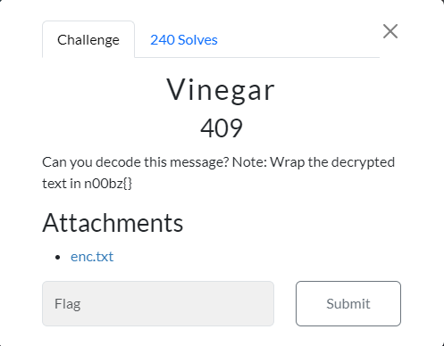
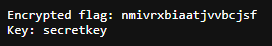
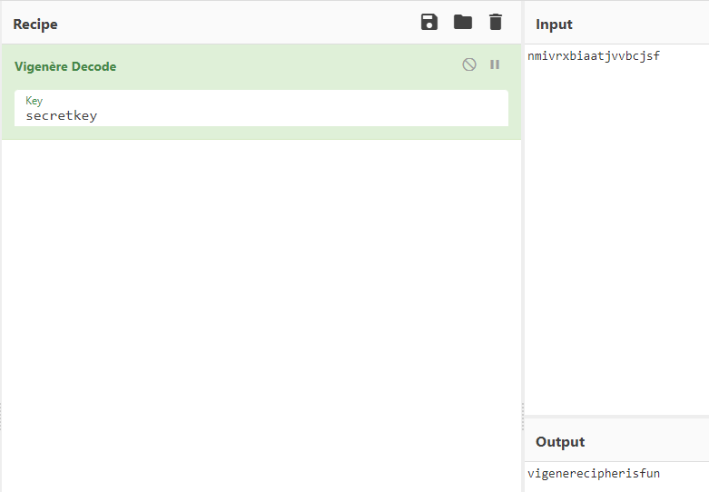

## Writeup

- Description: Can you decode this message? Note: Wrap the decrypted text in n00bz{}
- Flag: `n00bz{vigenerecipherisfun}`

We are given a text file, which includes a encrypted text and a key.

Judging by the wordplay of the challenge title, we can roughly guess that it is using Vignere cipher to encrypt the message.

Lord and behold, we wrap our message with `n00bz{}` and solve it.
