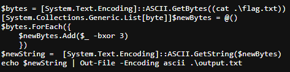

## Writeup

- Description: My friend told me they were going on vacation, but they sent me this weird PowerShell script instead of a postcard! Author: 0xBlue
- Flag: `n00bz{from_paris_wth_xor}`

We are presented with a PowerShell script and the output file.
The script basically performs a xor operation with each character and value 3.

We can just write a basic script to reverse the output.

