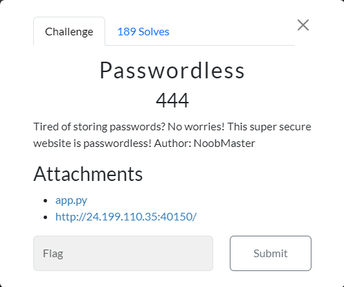
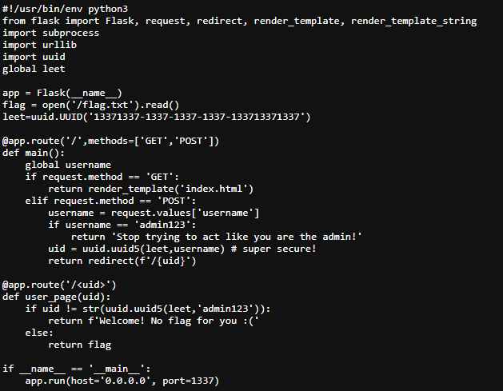
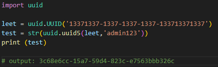
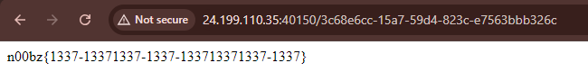

## Writeup

- Description: Tired of storing passwords? No worries! This super secure website is passwordless! Author: NoobMaster
- Flag: `n00bz{1337-13371337-1337-133713371337-1337}`

We are presented with the source code and the site.

We look at the `/<uid>` page, in which the condition checks for uuid ver. 5 of the `leet` variable and the user `admin123`.
This can be solved using a simple script.

With that, we can access the webpage with the flag.

